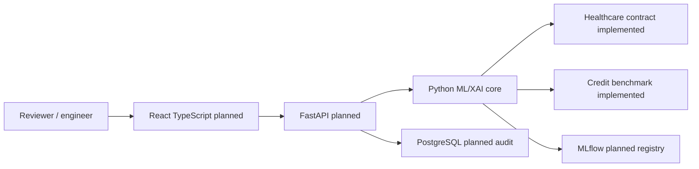

# Aletheia — Explainable AI Decision Auditor

Aletheia is an enterprise-style platform project for reproducible, explainable and auditable high-stakes tabular ML. Its **primary demonstration is 30-day hospital readmission risk** for encounters involving patients with diabetes. The approved South German Credit benchmark remains a **secondary demonstration**. This repository contains both data foundations, a credit training-only baseline and a healthcare model experiment with a locked holdout gate. It has no deployed application.

## Why and for whom

A risk score alone does not tell an ML engineer whether a model generalizes, or a human reviewer why a decision deserves attention. Aletheia's intended workflow joins valid model comparison, calibrated probabilities, explanations, constrained alternatives, subgroup checks, similar training cases and durable audit evidence. Intended users are ML engineers, human risk/clinical reviewers, and administrators. The healthcare demonstration is educational and **not a clinical decision support device or treatment recommendation**. It must not process real patient submissions in a public demo.

An engineer will verify a pinned dataset and patient split, train with group-aware cross-validation, compare models and approve one version. A reviewer will inspect an authorized, de-identified discharge encounter, risk, explanation and case context, then record review. An administrator will control model versions, roles and audit retention. Only the first part of the engineer journey is implemented.

## Current capabilities and roadmap

**Implemented:** official UCI 296 source identity and byte hashes; controlled extraction; strict 50-column loading; `?` normalization in seven documented fields; target/cohort/role validation; a frozen patient-group holdout; patient-aware nested CV, bounded candidate comparison, raw/sigmoid calibration comparison, immutable local experiment records and one-time holdout protection. Credit has an approved 1,000-row foundation and training-only Dummy/Logistic Regression baseline with immutable local manifests.

The completed healthcare experiment selected sigmoid-calibrated Histogram
Gradient Boosting using training-only patient folds. Its single locked-holdout
evaluation measured ROC-AUC 0.6395 and average precision 0.2026 on 19,535
encounters; at descriptive threshold 0.5 it detected 12 of 2,240 positives.
The full metrics and patient-cluster intervals are in the
[model card](docs/model_cards/healthcare_readmission_v1.md). These are
retrospective educational results, not clinical validation.

**Selected for later milestones:** global/local XAI, constrained counterfactuals, explanation stability, conditional fairness, similar-case retrieval, MLflow registry, FastAPI, PostgreSQL, React/TypeScript, Docker/Compose, GitHub Actions, monitoring and RBAC. **Provisional:** DagsHub-hosted MLflow versus self-hosting, DVC versus source hashes/locks, managed host, optional Hugging Face demo and optional OpenRouter narrator. **Rejected:** RunwayML, which has no role in tabular auditing. Similar-case retrieval is not collaborative filtering; a recommendation project would be separate.

Five macro milestones are on the roadmap: (1) healthcare foundation and deployable design **committed and externally reviewed**; (2) healthcare modelling/calibration **implemented locally, external review pending**; (3) explanations and audit methods; (4) application and MLOps; (5) public delivery and operations. Definitions of done are in [the execution plan](docs/EXECUTION_PLAN.md).

## Architecture and data flow



**Implemented healthcare flow:** official UCI archive → size/SHA-256 verification → safe two-file extraction → exact CSV/schema check → `?` normalization and target mapping → discharge-eligible cohort → separate predictor/audit views → patient-group split lock → training-only nested patient CV → frozen selection → full-training fit → exclusive holdout claim → one evaluation and model card. **Planned prediction flow:** authenticated request → schema/feature validation → registered fitted pipeline → probability and explanation → append-only audit event → response. Delivery code will call the core rather than duplicate preprocessing or policy.

## Healthcare dataset and leakage boundary

Source: [UCI Diabetes 130-US Hospitals for Years 1999–2008](https://archive.ics.uci.edu/dataset/296/diabetes+130-us+hospitals+for+years+1999-2008), ID 296, DOI [10.24432/C5230J](https://doi.org/10.24432/C5230J), CC BY 4.0; see [Strack et al. 2014](https://doi.org/10.1155/2014/781670). There are 101,766 raw inpatient encounters, 50 columns and 71,518 patient IDs. The target is `readmitted_30d=1` for `<30`; `>30` and `NO` are 0. The prediction time is **discharge**, after disposition is known and before the 30-day outcome is known. Death/hospice dispositions are excluded, leaving 99,343 encounters and 69,990 patients. The encounter key is `uci296-<encounter_id>`; `patient_nbr` is used for grouping. Both identifiers, discharge disposition and sensitive race/gender/age are barred from predictors. The policy currently allows 13 conservative discharge-time fields. Exact source/missingness/field decisions are in the [healthcare audit](docs/HEALTHCARE_DATASET_AUDIT.md).

The SHA-256 patient-group split assigns approximately 80%/20% independent of labels: training 79,808 encounters (70,734 negative, 9,074 positive; 56,178 patients), locked holdout 19,535 (17,295 negative, 2,240 positive; 13,812 patients). No patient or encounter crosses. Modelling CV also groups patients in five outer and three inner folds. The dataset lacks dates/hospital IDs, so this split is not temporal or external validation. Missing race and sparse subgroups constrain future fairness analysis; historical administered treatments and counts are not automatically actionable counterfactuals. Similar-case retrieval may use only authorized training cases with privacy controls and a versioned distance metric.

## Technology and connection map

Status is explicit. Configuration and artifacts are detailed in [deployment architecture](docs/DEPLOYMENT_ARCHITECTURE.md).

| Tool | Status, use and connection | Configuration, limits and alternative |
|---|---|---|
| Python 3.12, pandas, scikit-learn | Implemented core/credit baseline and healthcare tables; CLI calls contracts and produces validated frames/lock | `pyproject.toml`, `requirements.lock.txt`, versioned TOML; 8 GB laptop limits. Fold-local fit required. Polars is an unneeded alternative. |
| Healthcare nested-CV runner and local joblib | Implemented research experiment; frozen selection and checksummed model live under ignored `artifacts/healthcare-model-v1` | `configs/experiments/healthcare_model_v1.toml`; trusted local artifact only, never load user-supplied pickle/joblib. The one-time holdout claim prevents reruns. |
| Local JSON manifests | Implemented for credit experiment evidence; research runner writes ignored artifacts | `artifacts/runs`; no remote registry/concurrency. MLflow later. |
| MLflow | Selected for model metrics/artifacts and registry consumed by API | Future `MLFLOW_TRACKING_URI`; secrets and PHI exclusion; service outage blocks promotion. Local manifests are current fallback. |
| DagsHub-hosted MLflow | Provisional remote MLflow service | Future secret endpoint/credentials, non-sensitive metadata only; cost/retention review. Self-hosted MLflow fallback. |
| DVC | Provisional data pointer/version tool for training | Current raw SHA-256 + split lock suffice for UCI; remote storage and cost must be justified before adoption. |
| FastAPI | Selected typed REST layer calling research use cases | Future registry URI, `DATABASE_URL`, auth issuer/audience; validate and rate-limit. Django REST is heavier. |
| PostgreSQL | Selected transactional append-only audit/version metadata | Future secret `DATABASE_URL`, migrations/least privilege; audit write failure blocks served decision. SQLite is weaker for concurrent managed use. |
| React + TypeScript | Selected reviewer browser interface calling API JSON | Future `VITE_API_BASE_URL`; no PHI browser persistence. Next.js adds unneeded server surface. |
| Docker + Compose | Selected reproducible API packaging/local stack | Future pinned images, secret injection and health checks; Compose is not public orchestration. Host installs drift. |
| GitHub Actions | Selected CI tests/build/deploy gate and future code dependency graph artifact | Future protected environments/OIDC; no raw data on runners. Local checks remain fallback. |
| Managed public host | Provisional API/UI and managed PostgreSQL deployment | Vendor, region and cost unresolved; synthetic examples only. Self-hosting costs more operations. |
| Monitoring/drift | Selected aggregate service/model checks after deployment | Versioned baselines/alerts; drift is not proof of harm. Manual review fallback. |
| Hugging Face cards | Selected future model/dataset provenance and limitations | No sensitive artifact upload; repository Markdown fallback. Hosted demo provisional and synthetic only. |
| OpenRouter narrator | Provisional optional prose from computed explanations | Future API key secret; no patient values, hallucination/cost risk. Deterministic templates default. |
| Authentication/RBAC, immutable audit | Selected role enforcement and append-only prediction/review trail in API/PostgreSQL | Future OIDC/retention/secrets; database admins still require governance. No anonymous real-data serving. |
| RunwayML | Rejected media generation service | No tabular audit requirement; reconsider only for a real media use case. |

## Repository map

`src/aletheia/data`, `ml`, `experiments` contain the existing credit pipeline. `src/aletheia/domains/healthcare` contains the foundation, modelling, evaluation, experiment and CLI. `configs/datasets`, `features`, `splits`, `experiments` hold healthcare identities, roles, split lock and modelling protocol; credit configurations remain. `tests/healthcare` contains offline tests; `docs` records audit, architecture, decisions, model card, report and supervisor evidence. Raw data and run artifacts are ignored.

## Installation and commands

Use Python 3.12 in a virtual environment; no future application dependencies are installed. From the repository root:

```powershell
py -3.12 -m venv .venv
.\.venv\Scripts\python.exe -m pip install -r requirements.lock.txt
.\.venv\Scripts\python.exe -m pip check
.\.venv\Scripts\python.exe -m aletheia.domains.healthcare acquire
.\.venv\Scripts\python.exe -m aletheia.domains.healthcare verify
.\.venv\Scripts\python.exe -m aletheia.domains.healthcare model
.\.venv\Scripts\python.exe -m ruff check .
.\.venv\Scripts\python.exe -m ruff format --check .
.\.venv\Scripts\python.exe -m pytest -m "not live_data"
```

The archive and CSV go under ignored `data/raw/healthcare`. `acquire` downloads only the official HTTPS archive, verifies byte identity and extracts two approved members. On a local Python TLS certificate failure, obtain the same official URL through a trusted TLS-capable client into that ignored path, then rerun `acquire`; never bypass checksum validation. `verify` checks the frozen lock and prints partition sizes. `lock` creates a new lock only if absent and is for protocol regeneration under approval; it refuses overwrite. `model` is a single-use experiment: it runs training-only evidence twice, freezes selection, then claims and evaluates the holdout once. It refuses an existing run directory; do not delete a completed run to tune against its result. Configuration files are versioned TOML; no credentials are needed now. A later API will use environment-backed secrets; `.env` files stay ignored. The ordinary test suite is synthetic and offline; `live_data` tests are opt-in.

## Limits, licence and review

The UCI records are historical (1999–2008), omit hospital/date identity, contain missing and rare groups, and have no clinical or external validation. Healthcare predictive performance has been measured only on the frozen retrospective patient split. Fairness, counterfactual feasibility, latency, security posture and deployment have not been established. The repo's software licence should be checked in the repository before reuse; dataset reuse follows **CC BY 4.0** with UCI/Strack attribution. This is not medical advice.

Read [product requirements](docs/PRODUCT_REQUIREMENTS.md), [dataset audit](docs/HEALTHCARE_DATASET_AUDIT.md), [architecture](docs/ARCHITECTURE.md), [deployment design](docs/DEPLOYMENT_ARCHITECTURE.md), [execution plan](docs/EXECUTION_PLAN.md), [project report](docs/PROJECT_REPORT.md), [credit audit](docs/DATASET_AUDIT.md), [ADRs](docs/decisions), and [supervisor handoff](docs/SUPERVISOR_HANDOFF.md). Macro Milestone 1 is committed at `49753d5` and passed external review with this minor repair pending. No deployment exists; Codex has not committed this repair.
