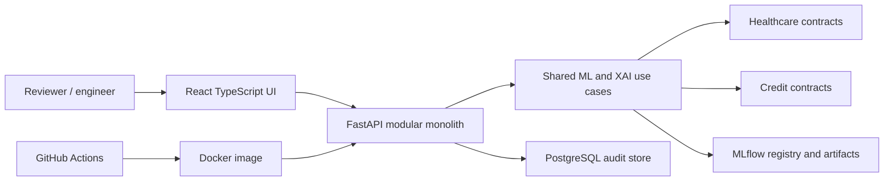

# Deployable architecture and tooling decision

Status: design selected in Macro Milestone 1; only Python/scikit-learn, local manifests, and data foundations are implemented. No server, model registry, UI, database, container, CI or deployment exists.

The current credit package remains at `src/aletheia/data`, `ml`, and `experiments`. Healthcare policy is at `src/aletheia/domains/healthcare`. Shared use cases may be extracted only once both domains need them. Domain target, roles, split and future recourse constraints cannot be shared blindly. HTTP and UI call validated use cases; they never reimplement transformations. Future prediction flow: authenticated request → role/schema validation → registered fitted pipeline → probability/calibration → local explanation and similar training cases → append-only audit event → response. The API must not accept raw identifiable health records in the public demo.

## Tooling matrix

Each row states status, role and connection, configuration and artifact, risks and alternative. Milestone numbers refer to `PRODUCT_REQUIREMENTS.md`.

| Tool | Status / milestone | Role, caller, input → output | Config, security, failure and alternative |
|---|---|---|---|
| Python 3.12, pandas, scikit-learn | Implemented / 1 credit + healthcare data; model use in 2 | CLI and later training use tables → validated data, pipelines and metrics | `pyproject.toml`, lockfile, TOML contracts. Fit preprocessing only in group folds. 8 GB limits wide one-hot tables. Polars is an alternative but increases migration cost. |
| Local immutable manifests | Implemented for credit / 1 | Research runs → inspectable JSON identities and results | Ignored `artifacts/runs`; no concurrency/remote registry. Superseded gradually by MLflow if evidence migrates safely. |
| MLflow | Selected / 4 | Training use case logs parameters, metrics, artifacts and model versions → registry IDs consumed by API | `MLFLOW_TRACKING_URI`, credentials in secret store. Avoid PHI in runs; registry availability and artifact compatibility are risks. Local manifests alone lack approval lifecycle. |
| DagsHub-hosted MLflow | Provisional / 4 | Remote MLflow backend for public non-sensitive experiment metadata | Endpoint/credentials secret; pricing, availability, retention and access must be reviewed. Self-hosted MLflow with object storage is fallback. No patient-level data uploaded. |
| DVC | Provisional / 2–4 | Version data pointers and checksums alongside Git; training consumes pinned source identity | `dvc.yaml` only after adoption; remote storage/access/cost must be evaluated. Current pinned UCI bytes + Git contracts/lock are a justified lightweight alternative for one public immutable source. |
| FastAPI | Selected / 4 | Typed REST adapter calls validated model/audit use cases → versioned response/OpenAPI | `DATABASE_URL`, registry URI, auth issuer/audience, model stage. Prevent identifier leakage, validate input, rate limit. Django REST is heavier; direct notebook serving is unsafe. |
| PostgreSQL | Selected / 4 | API records model version, request hash/reference, prediction, explanation ID and append-only review event | `DATABASE_URL` secret, migrations, encryption, least privilege, retention. Transaction/connection failures must fail closed for audited prediction. SQLite lacks intended concurrent managed operation. No raw clinical record storage. |
| React + TypeScript | Selected / 4 | Browser reviewer dashboard consumes API JSON → comparison and encounter review | `VITE_API_BASE_URL`; avoid storing health data in browser/local storage. Next.js adds server complexity without a current need. |
| Docker + Compose | Selected / 4 | Package API and local development dependencies → reproducible containers | Image pinning, secret injection, nonroot runtime, health checks; Compose is local only. Direct host installs drift; Kubernetes unjustified. |
| GitHub Actions | Selected / 5 | CI runs tests, formatting, security checks, image build → evidence and deploy gate | OIDC/short-lived secrets, protected environment, no raw data. Hosted runner limits/network failures; local command fallback. Future code graph parses Python/TypeScript imports, detects cycles/forbidden directions, publishes CI artifact and maps nodes to architecture. |
| Managed public deployment | Provisional / 5 | Host API/UI and managed PostgreSQL, use registry artifact → public demonstration | Vendor, region, cost and availability unresolved; use only synthetic/de-identified examples. Self-hosted VPS is fallback with more operations burden. Deployment is blocked until auth/audit/privacy checks. |
| Monitoring/drift checks | Selected / 5 | API operational metrics + approved aggregate feature/prediction distributions → alerts and review | No raw identifiers in logs; thresholds/baselines versioned. Drift is a signal, not proof of model harm. Manual periodic review is fallback. |
| Hugging Face cards | Selected / 2–5 | Publish model/dataset documentation, provenance and limitations → inspectable public evidence | No fitted model or sensitive data upload without approval; licenses and provenance required. Markdown in repo is fallback. Optional hosted demonstration is provisional and must remain synthetic. |
| OpenRouter narrator | Provisional / 5 | Optional text rendering of already computed explanation evidence → reviewer prose | API key secret; no patient values sent; hallucination and cost risk. Deterministic templates are default fallback. Narration cannot create evidence. |
| Authentication + RBAC | Selected / 4 | Identity provider claims → engineer/reviewer/admin permissions | OIDC issuer/audience, server-side policy, short sessions. Simplified demo auth still needs enforced roles; unauthenticated public predictions are rejected for real data. |
| Immutable audit logging | Selected / 4 | API writes append-only event and hash chain/version → replayable decision trace | PostgreSQL transaction, restricted writes, retention/export checks. DB administrator can still alter storage without external anchoring; cryptographic anchoring may follow. |
| RunwayML | Rejected | No legitimate tabular audit role | Media-generation cost/dependency would not solve a requirement. Reconsider only for a genuine visual media need. |

Data flow in milestone 1: official HTTPS archive → SHA-256 verification → controlled two-member extraction → strict CSV/schema/target validation → discharge-eligible cohort → feature and audit views → locked patient split. Future training, registry and serving are designed only. Secrets belong in deployment secret managers/environment, never TOML or Git. Model artifact format, host vendor, DagsHub versus self-hosting, and DVC adoption require later approval and migration plans. Network outages, registry unavailability, schema/version mismatch and audit-write failure must prevent untracked serving.
